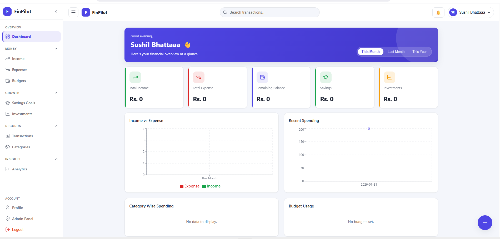
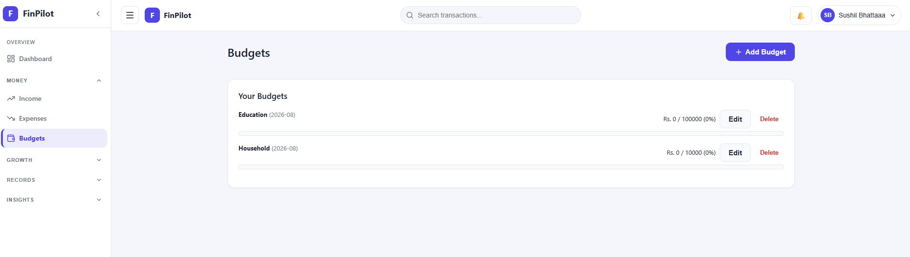
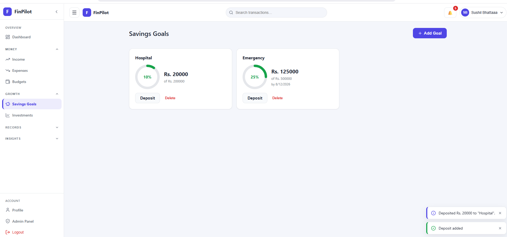
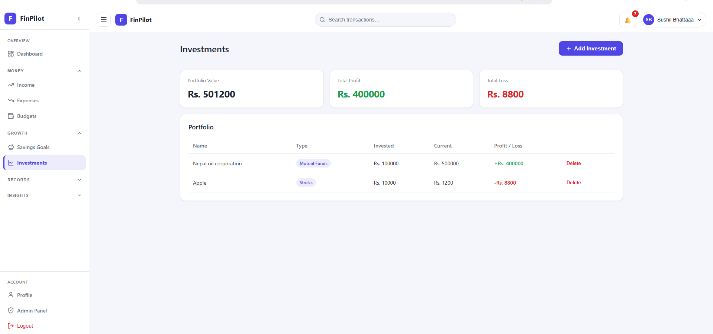
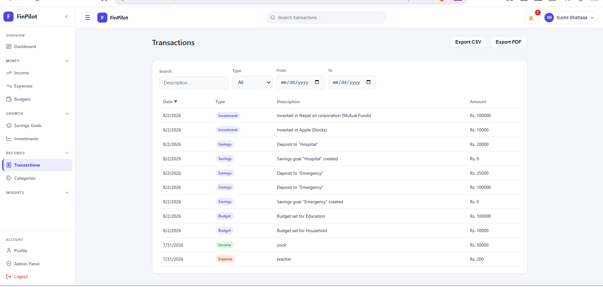
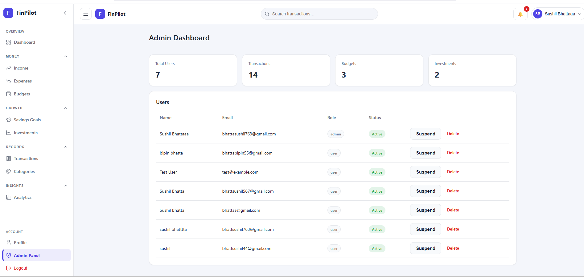
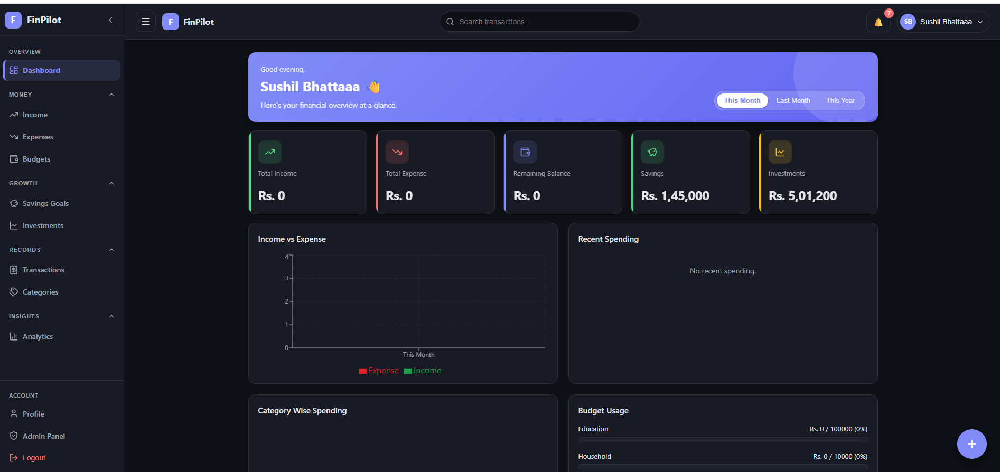

# FinPilot – Personal Finance & Investment Dashboard

## Overview
FinPilot is a full-stack MERN personal finance application for managing income, expenses, budgets, savings goals, investments, and real-time notifications. It provides a dashboard-style interface with charts, analytics, transaction history with export, custom categories, an admin panel, and role-based access control. It was built as part of the **Codveda Full-Stack Development Internship**.

## Tech Stack

| Layer | Technology |
|-------|------------|
| Frontend | React, TypeScript, Vite, React Router, Axios, Recharts, Socket.io-client, lucide-react |
| Backend | Node.js, Express.js, JWT, bcrypt, Socket.io |
| Database | MongoDB Atlas, Mongoose |
| Tooling | oxlint, Thunder Client / Postman, Nodemon |

## Features
- **Authentication** — JWT-based auth, bcrypt password hashing, protected routes, role-based access (user/admin)
- **Dashboard** — aggregated stats and charts (income vs expense, category breakdown, budget usage)
- **Income & Expense tracking** — full CRUD, scoped per user
- **Budget management** — create/edit/delete, auto-calculated spent amount, exceed alerts (80%/90%/100%)
- **Savings goals** — create goals, deposit money, auto-complete on target reached
- **Investment portfolio** — track stocks/crypto/gold/etc. with profit/loss calculation
- **Transaction history** — unified activity log with search/filter/sort and CSV & PDF export
- **Custom categories** — per-user category CRUD
- **Analytics** — charts for income growth, savings growth, and category spending
- **Real-time notifications** — Socket.io live alerts with a notification bell and toast alerts
- **Admin panel** — user management, suspend users, platform-wide statistics
- **Profile management** — update info, change password, light/dark theme support

## Project Structure

```
finpilot/
├── backend/
│   └── src/
│       ├── config/
│       ├── models/
│       ├── controllers/
│       ├── routes/
│       └── middleware/
├── frontend/
│   └── src/
│       ├── api/
│       ├── components/
│       ├── context/
│       ├── pages/
│       └── types/
├── docs/
│   ├── level-1/
│   ├── level-2/
│   └── level-3/
├── screenshots/
└── README.md
```

## Getting Started

### Prerequisites
- Node.js v18+
- npm
- MongoDB Atlas account (or local MongoDB)

### Installation
```bash
git clone <repo-url>
cd finpilot

# Backend
cd backend
npm install
# create .env with MONGO_URI, JWT_SECRET, PORT
npm run dev

# Frontend (new terminal)
cd frontend
npm install
# create .env with VITE_API_URL
npm run dev
```

## Environment Variables

**backend/.env**

| Variable | Description |
|----------|-------------|
| `PORT` | Port the backend server runs on (e.g. `5000`) |
| `MONGO_URI` | MongoDB Atlas connection string |
| `JWT_SECRET` | Secret key used to sign JWT tokens |

**frontend/.env**

| Variable | Description |
|----------|-------------|
| `VITE_API_URL` | Backend API base URL (e.g. `http://localhost:5000/api`) |

## API Overview

All routes are prefixed with `/api`. Protected routes require an `Authorization: Bearer <token>` header. A condensed summary is below — see the [docs/](docs/) for detailed request/response examples.

| Resource | Base Route | Endpoints | Access |
|----------|-----------|-----------|--------|
| Auth | `/auth` | register, login, me, users | Public / User / Admin |
| Income | `/income` | list, create, update, delete | User |
| Expenses | `/expenses` | list, create, update, delete | User |
| Budgets | `/budgets` | list, create, update, delete | User |
| Savings | `/savings` | list, create, update, delete, deposit | User |
| Investments | `/investments` | list, create, update, delete | User |
| Categories | `/categories` | list, create, update, delete | User |
| Transactions | `/transactions` | list, export CSV, export PDF | User |
| Notifications | `/notifications` | list, mark read, delete | User |
| Dashboard | `/dashboard` | stats | User |
| Profile | `/profile` | get, update, change password | User |
| Admin | `/admin` | users, suspend, reports, stats | Admin |

## Internship Task Mapping

| Level | Task | Status | Docs |
|-------|------|--------|------|
| Level 1 | Task 1: Environment Setup | ✅ Done | [docs/level-1/task-1-environment-setup.md](docs/level-1/task-1-environment-setup.md) |
| Level 1 | Task 2: REST API | ✅ Done | [docs/level-1/task-2-rest-api.md](docs/level-1/task-2-rest-api.md) |
| Level 2 | Task 1: Frontend Framework | ✅ Done | [docs/level2/task-1-frontend-framework.md](docs/level2/task-1-frontend-framework.md) |
| Level 2 | Task 2: Authentication | ✅ Done | [docs/level2/task-2-auth.md](docs/level2/task-2-auth.md) |
| Level 2 | Task 3: Database Integration | ✅ Done | [docs/level2/task-3-database.md](docs/level2/task-3-database.md) |
| Level 3 | Task 1: Full-Stack Application | ✅ Done | [docs/level-3/task-1-fullstack-application.md](docs/level-3/task-1-fullstack-application.md) |
| Level 3 | Task 2: WebSockets | ✅ Done | [docs/level-3/task-2-websockets.md](docs/level-3/task-2-websockets.md) |

## Screenshots

| Dashboard | Budgets |
|:---:|:---:|
|  |  |
| **Overview with charts & stats** | **Budget progress & alerts** |

| Savings Goals | Investments |
|:---:|:---:|
|  |  |
| **Goal tracking & deposits** | **Portfolio profit / loss** |

| Transactions | Admin Panel |
|:---:|:---:|
|  |  |
| **Search, filter & export** | **User management & stats** |

| Real-Time Notification | Dark Theme |
|:---:|:---:|
|  |  |
| **Socket.io toast alert** | **Light / dark mode support** |

_See the [docs/](docs/) folder for the full set of screenshots per task._

## Demo Video
🎥 [Demo Video](VIDEO_LINK_HERE) <!-- TODO: add LinkedIn/YouTube video link once recorded -->

## Author
**Sushil Bhatta**
- GitHub: <https://github.com/Sushil-Bhatta-sb>
- LinkedIn: <https://www.linkedin.com/in/sushil-bhatta>
- Portfolio: <https://sushil-bhatta.com.np>

## License
This project is released under the MIT License. <!-- TODO: add a LICENSE file at the project root -->