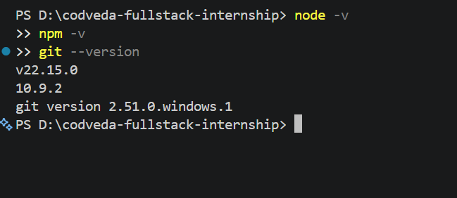
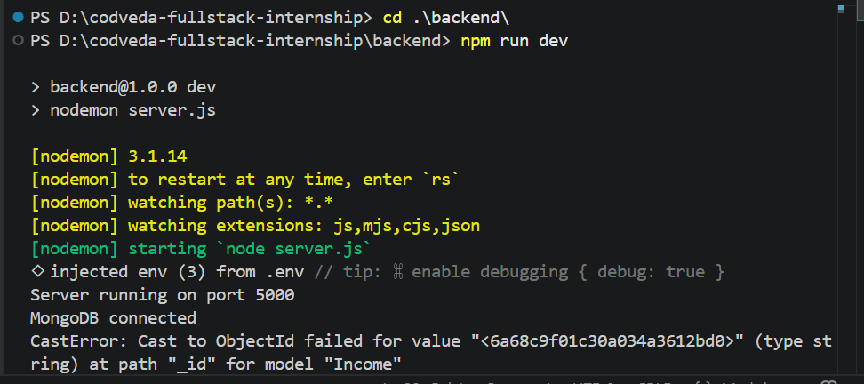

# Task 1: Development Environment Setup

## Tools Installed
- Node.js: v20.x
- npm: v10.x
- Git: v2.x
- Code Editor: VS Code
- Database: MongoDB Atlas (cloud-hosted)

## Verification

## Repository
GitHub: <https://github.com/Sushil-Bhatta-sb/codveda-fullstack-internship>

## Basic Git Commands Practiced
- git init
- git add .
- git commit -m "message"
- git push origin main
