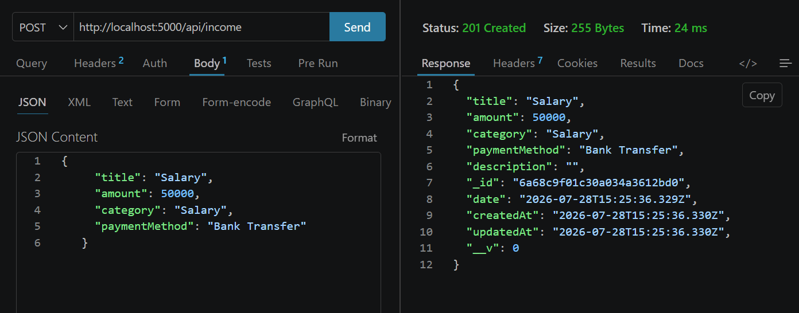
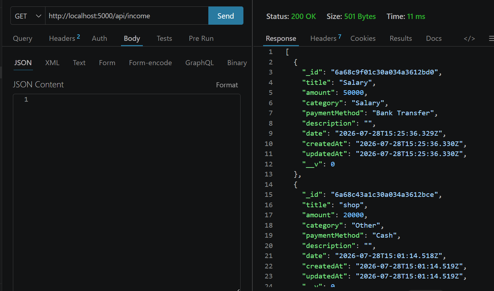
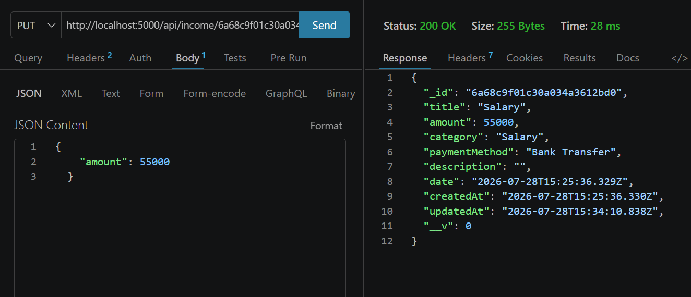
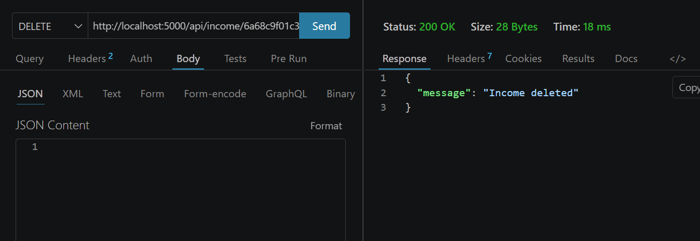
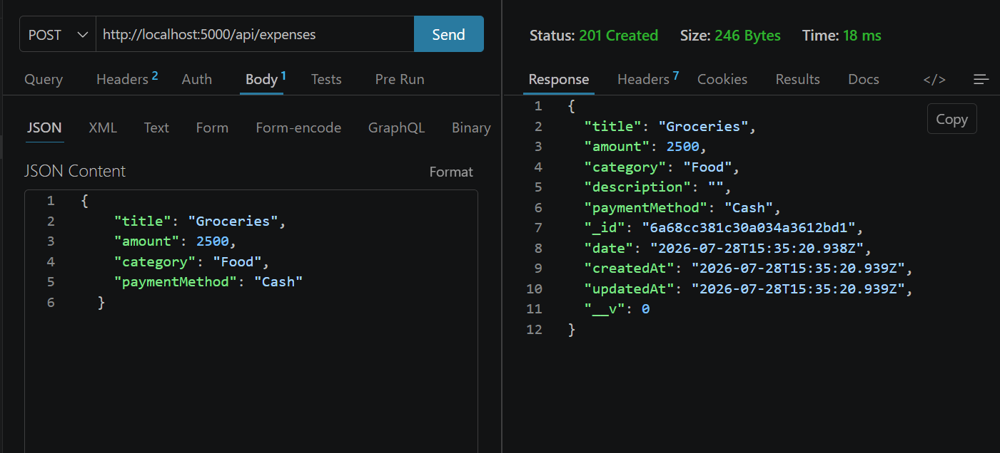
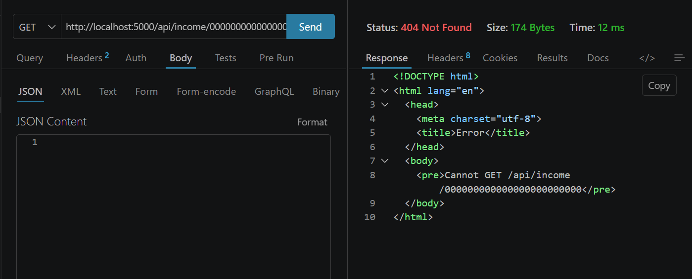

# Task 2: Build a Simple REST API

## Overview
Built a REST API using Node.js + Express + MongoDB (Mongoose) with full CRUD
for two resources: Income and Expense.

## Endpoints

### Income
| Method | Endpoint          | Description        |
|--------|-------------------|---------------------|
| GET    | /api/income       | Get all income      |
| POST   | /api/income       | Create income entry |
| PUT    | /api/income/:id   | Update income entry |
| DELETE | /api/income/:id   | Delete income entry |

### Expense
| Method | Endpoint            | Description           |
|--------|----------------------|------------------------|
| GET    | /api/expenses        | Get all expenses       |
| POST   | /api/expenses         | Create expense entry   |
| PUT    | /api/expenses/:id     | Update expense entry   |
| DELETE | /api/expenses/:id     | Delete expense entry   |

## API Testing

### Tools Used
- Thunder Client (VS Code extension) — used during development
- Postman — used to create a shareable collection for submission

### Postman Collection

A full Postman collection covering every endpoint (GET, POST, PUT, DELETE for both Income and Expense, including error cases) is included at `postman/finpilot-level1.postman_collection.json`.

To test it:
1. Open Postman
2. Click Import → select the collection file above
3. Set the collection variable `baseUrl` to `http://localhost:5000/api`
4. Run each request in order (Create → Get → Update → Delete)

### Manual Test Screenshots

**Create income**

	

**Get all income**

	

**Update income**

	

**Delete income**

	

**Create expense**

	

**Error handling - invalid ID**

	

## Error Handling
Centralized error handler middleware returns JSON errors with proper HTTP
status codes (404 for not found, 500 for server errors).
