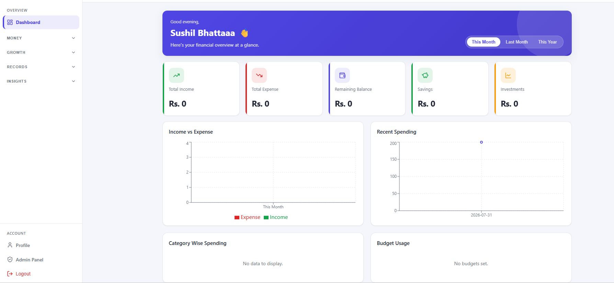

# Task 1: Build a Full-Stack Application (MERN)

## Overview
Extended FinPilot into a complete full-stack personal finance application 
covering all core modules: Authentication, Dashboard, Income, Expense, 
Budgets, Savings Goals, Investments, Transactions, Categories, Analytics, 
Profile, and Admin Panel — with full role-based access control (user/admin).

## Modules Implemented
| Module | Description |
|--------|--------------|
| Authentication | Register, login, JWT, bcrypt password hashing, protected routes |
| Dashboard | Aggregated stats, charts (income vs expense, category breakdown, budget usage) |
| Income & Expense | Full CRUD, scoped per user |
| Budgets | Create/edit/delete, auto-calculated spent amount, exceed alerts |
| Savings Goals | Create goals, deposit money, auto-complete on target reached |
| Investments | Track stocks/crypto/gold/etc, profit/loss calculation |
| Transactions | Unified activity log, search/filter/sort, CSV & PDF export |
| Categories | Custom category CRUD per user |
| Analytics | Charts for income growth, savings growth, category spending |
| Profile | Update personal info, change password, theme preference |
| Admin Panel | User management, suspend users, view platform-wide stats |

## Role-Based Access
- Regular users can only access and modify their own data (enforced via 
  `user` ownership checks on every query)
- Admin-only routes protected by `authorize('admin')` middleware, covering 
  user management and platform statistics

## UI/UX Design
The application uses a dashboard-style layout with a collapsible, grouped 
sidebar navigation instead of a flat link list, to keep the interface 
manageable as feature count grew.

**Navigation structure:**
- Grouped sections: Overview, Money (Income/Expenses/Budgets), Growth 
  (Savings/Investments), Records (Transactions/Categories), Insights 
  (Analytics), and a pinned Account section (Profile/Admin/Logout)
- Sidebar collapses to an icon-only rail with flyout popovers, expandable 
  on demand
- Active route auto-expands its parent group and highlights with a colored 
  border and bold text
- Fully responsive: overlay drawer navigation on mobile

**Supporting UI elements:**
- Reusable Modal component for create/edit forms (Budgets, Investments, 
  Categories, Savings deposits) instead of always-visible inline forms
- Toast notification system for form feedback and real-time Socket.io 
  alerts
- Skeleton loading states and empty-state messaging on all list views
- Light/dark theme support via CSS custom properties, respected across 
  every component
- Consistent Card and Badge components for stats, budget progress, and 
  status indicators

## Screenshots

**Dashboard — overview with charts & stats**

  

**Collapsed sidebar navigation**

  

**Budgets — progress bars & exceed alerts**

  

**Savings Goals — goal tracking & deposits**

  

**Investments — portfolio profit / loss**

  

**Transactions — search, filter & export**

  

**Admin Panel — user management & stats**

  

**Dark theme — light / dark mode support**

  

## Deployment Readiness
- Backend configured for Render (env vars: MONGO_URI, JWT_SECRET, 
  FRONTEND_URL, PORT)
- Frontend configured for Vercel with SPA rewrite rules
- Database: MongoDB Atlas (cloud-hosted, already in use since Level 1)
