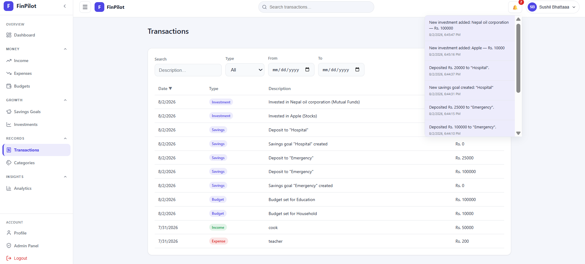
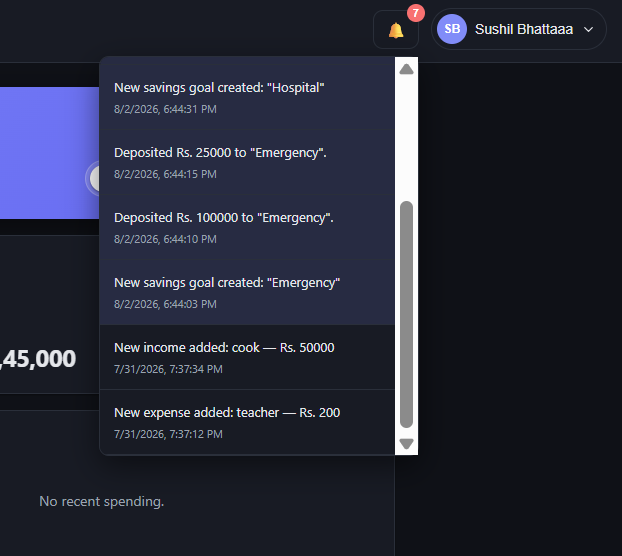
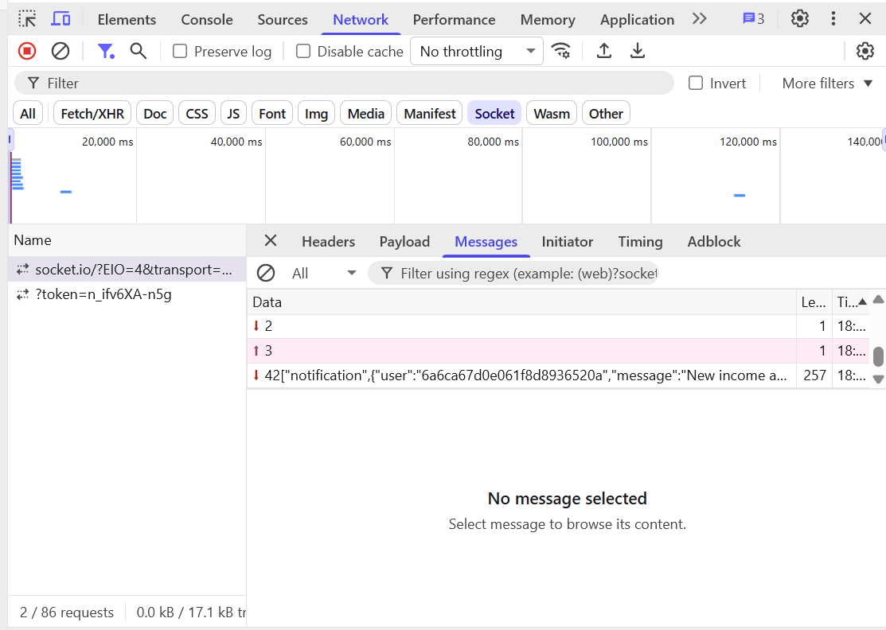

# Task 2: WebSockets for Real-Time Communication

## Overview
Implemented Socket.io for real-time, no-refresh notifications delivered 
to individual users.

## Implementation
- Backend: Socket.io server attached to the existing Express HTTP server. 
  Each connected client joins a room identified by their user ID.
- Events emitted:
  - Budget exceeded (80%, 90%, 100% thresholds)
  - Savings goal completed
  - Investment updated
- Frontend: socket.io-client establishes a connection on login (joins the 
  user's room), listens for `notification` events, updates a live 
  notification bell in the UI, and triggers toast alerts.
- Real-time events also trigger toast notifications in the UI (in addition 
  to the notification bell dropdown), so alerts are immediately visible 
  without requiring the user to open the bell.

## Testing
Verified that:
- Notifications are delivered instantly without a page refresh
- Notifications are private — only the relevant user's room receives 
  their own events
- Socket disconnects cleanly on logout

## Screenshots

