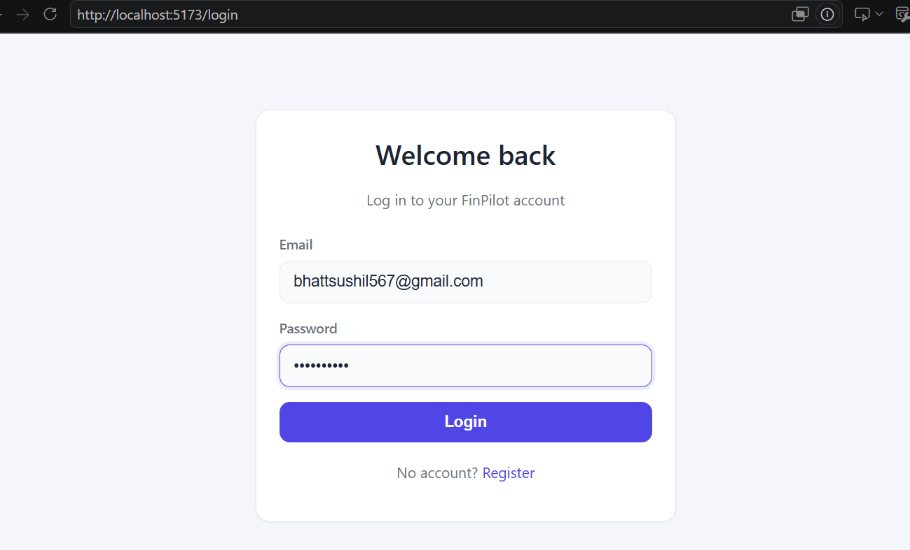
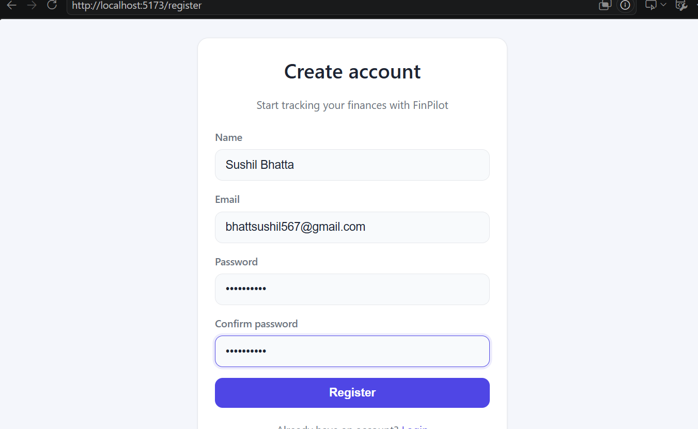
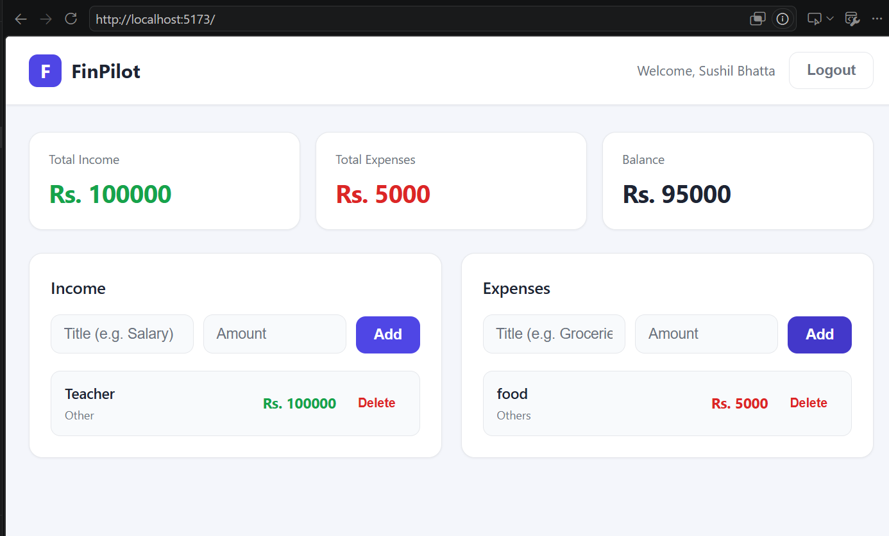

# Task 1: Frontend with a JavaScript Framework (React)

## Overview
Rebuilt the FinPilot frontend using **React 19 + TypeScript + Vite** for a
modern, component-based architecture. The app uses functional components with
hooks, centralized state management via the Context API, typed API calls with
loading states, and a set of reusable UI components.

## Tech Stack
- **React 19** + **TypeScript** — component-based, type-safe UI
- **Vite** — fast dev server and build tool
- **React Router v7** — client-side routing and protected routes
- **Axios** — HTTP client with request/response interceptors

## Objectives Covered
| Objective | How it was implemented |
|-----------|------------------------|
| Set up a project with React | Vite + React + TypeScript project under `frontend/` |
| Use functional components and state management | All components use hooks; global auth state in `AuthContext` (Context API) |
| Implement API calls and handle loading states | Typed Axios services in `src/api/`; every form/list shows spinners while requests are pending |
| Create reusable UI components | `Button`, `Input`, `Card`, `Spinner` in `src/components/ui/` |

## Project Structure
```
frontend/src/
  api/            # Axios client + typed service calls (auth, income, expense)
  components/
    ui/           # Reusable UI: Button, Input, Card, Spinner
    incomeList.tsx
    expenseList.tsx
    ProtectedRoute.tsx
  context/
    AuthContext.tsx   # Global auth state (login, register, logout)
  pages/
    Login.tsx
    Register.tsx
  types/          # Shared TypeScript interfaces
  App.tsx         # Routes + Dashboard
```

## Reusable UI Components
| Component | Purpose |
|-----------|---------|
| `Button` | Variants (primary/secondary/danger/ghost), built-in loading spinner, full-width option |
| `Input` | Labeled input with consistent focus styling |
| `Card` | Surface container used for panels and auth forms |
| `Spinner` | Inline loading indicator for lists |

## State Management
- `AuthContext` centralizes the authenticated user, token, and the
  `login` / `register` / `logout` actions.
- The Dashboard lifts income and expense totals into local state to render a
  live **Total Income / Total Expenses / Balance** summary.

## Loading & Feedback States
- Login/Register buttons show a spinner and disable while the request is in
  flight.
- Income and Expense lists show a loading spinner on first fetch, an empty
  state when there is no data, and inline error messages on failure.

## Styling
A custom design system was added via CSS variables in
[frontend/src/index.css](../../frontend/src/index.css) and component styles in
[frontend/src/App.css](../../frontend/src/App.css), including automatic
light/dark mode support.

## Running the Frontend
```bash
cd frontend
npm install
npm run dev
```
Set `VITE_API_URL` in `frontend/.env` to the backend API base URL
(e.g. `http://localhost:5000/api`).

## Screenshots
**Login page**


**Register page**


**Dashboard with summary**

