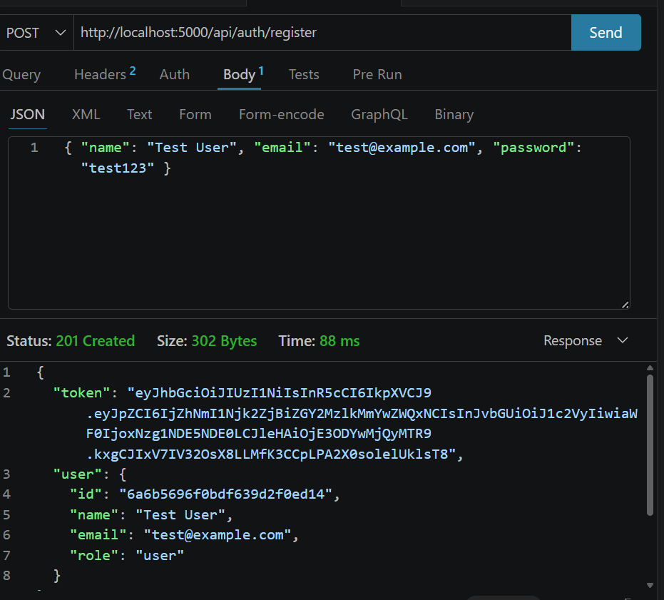
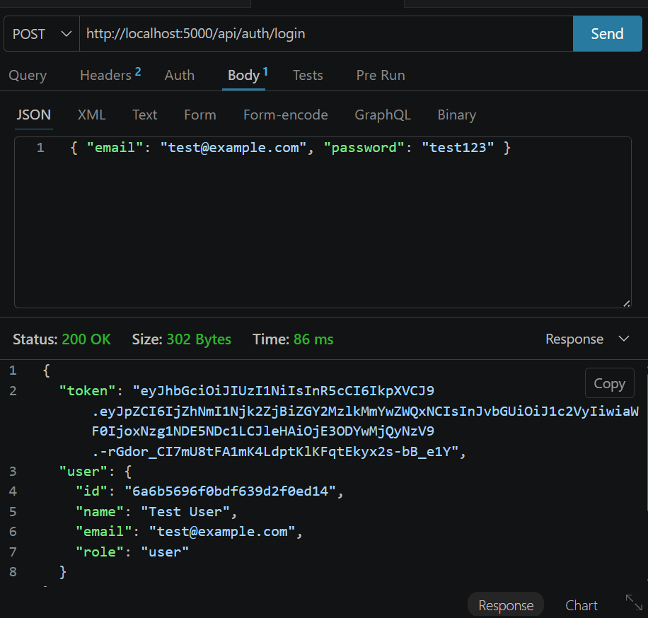
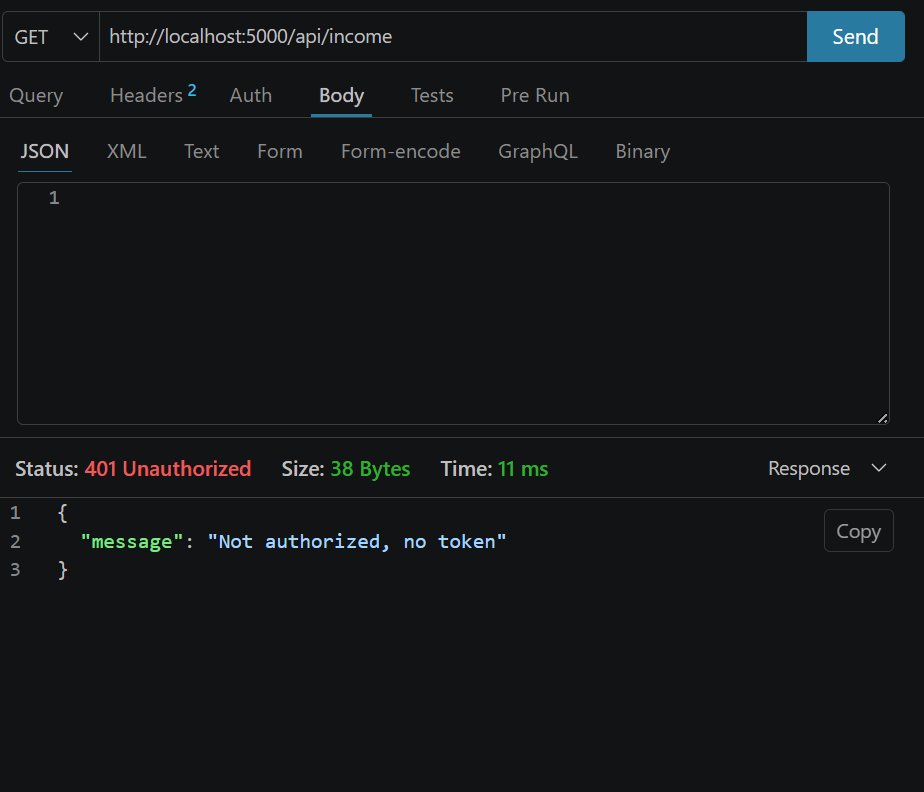

# Task 2: Authentication and Authorization

## Overview
Implemented user authentication (signup/login) using **bcrypt** for password
hashing and **JWT** for stateless sessions. Backend routes are protected with
middleware, and access can be restricted based on user **roles**
(`user` / `admin`).

## Objectives Covered
| Objective | How it was implemented |
|-----------|------------------------|
| User authentication using bcrypt and JWT | Passwords hashed with `bcryptjs`; JWT issued on register/login |
| Hash passwords before saving | `pre('save')` hook on the `User` model hashes the password with a salt |
| Store tokens securely | JWT stored in `localStorage` and auto-attached via Axios interceptor |
| Protect routes | `protect` middleware validates the Bearer token on every private route |
| Restrict access based on user roles | `authorize('admin')` middleware guards admin-only endpoints |

## Auth Endpoints
| Method | Endpoint            | Access        | Description                    |
|--------|---------------------|---------------|--------------------------------|
| POST   | /api/auth/register  | Public        | Create account, returns JWT    |
| POST   | /api/auth/login     | Public        | Login, returns JWT             |
| GET    | /api/auth/me        | Authenticated | Get current user               |
| GET    | /api/auth/users     | Admin only    | List all users (role-based)    |

## Password Hashing
Passwords are never stored in plain text. The `User` model hashes the password
before saving and exposes a `comparePassword()` helper for login:

```js
userSchema.pre('save', async function () {
  if (!this.isModified('password')) return;
  const salt = await bcrypt.genSalt(10);
  this.password = await bcrypt.hash(this.password, salt);
});
```

## JWT Flow
1. On register/login the server signs a JWT containing the user `id` and `role`
   (expires in 7 days).
2. The frontend stores the token and attaches it as `Authorization: Bearer
   <token>` on every request via an Axios interceptor.
3. The `protect` middleware verifies the token, loads the user, and attaches it
   to `req.user`.
4. On a `401` response the frontend clears the token and redirects to `/login`.

## Role-Based Access Control
- The `User` model has a `role` field (`enum: ['user', 'admin']`, default
  `user`).
- The `authorize(...roles)` middleware returns `403 Forbidden` when the user's
  role is not permitted.
- Example: `GET /api/auth/users` is guarded by
  `protect, authorize('admin')`.

## Frontend Protection
- `AuthContext` verifies the session on load via `GET /api/auth/me`.
- `ProtectedRoute` redirects unauthenticated users to `/login`.
- The registration form validates minimum password length and confirms the
  password before submitting.

## Testing
### Postman Collection
A Postman collection covering register, login, `me`, protected access, and the
admin-only route is included at:
`postman/finpilot-level2.postman_collection.json`

Steps:
1. Register or login to obtain a JWT.
2. Set the collection variable `token` to the returned JWT.
3. Call `GET /api/auth/me` with the token to confirm access.
4. Call `GET /api/auth/users` with a normal user token to see `403`, then with
   an admin token to see the user list.

### Screenshots
**Register (JWT returned)**


**Login (JWT returned)**


**Protected route without token (401)**


## Error Handling
- `400` — email already registered / invalid input
- `401` — missing, invalid, or expired token; wrong credentials
- `403` — authenticated but insufficient role
- `404` — user not found
