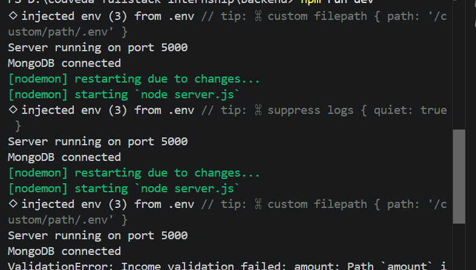
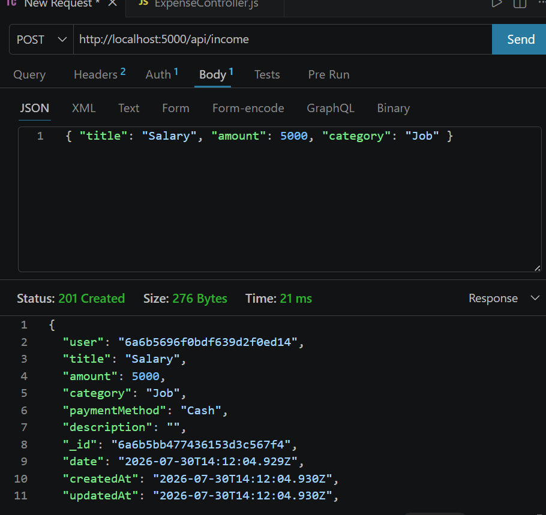
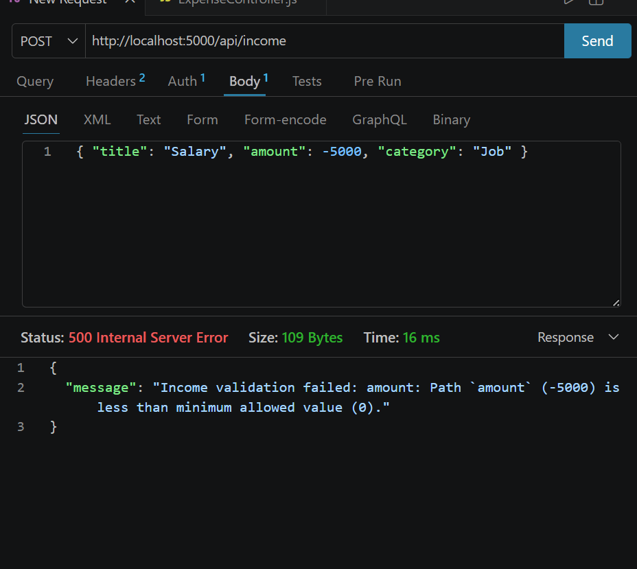

# Task 3: Database Integration (MongoDB + Mongoose)

## Overview
Integrated **MongoDB** (Atlas) using the **Mongoose** ORM. The app defines three
models with relationships, enforces data validation before saving, and adds
indexes for query optimization. All CRUD operations are scoped to the
authenticated user.

## Objectives Covered
| Objective | How it was implemented |
|-----------|------------------------|
| Use MongoDB with Mongoose ORM | Connection in `src/config/db.js`; schemas in `src/models/` |
| Create models and relationships | `User`, `Income`, `Expense`; income/expense reference `User` |
| Implement indexing and optimization | Compound index `{ user: 1, date: -1 }` on income/expense; unique index on email |
| Perform data validation before saving | `required`, `min`, `trim`, `enum`, and `minlength` validators |

## Models
| Model | Key Fields | Notes |
|-------|-----------|-------|
| **User** | `name`, `email` (unique, lowercase), `password` (min 6), `role` (enum user/admin) | Password hashed pre-save |
| **Income** | `user` (ref User), `title`, `amount` (min 0), `date`, `category`, `paymentMethod`, `description` | Indexed by `{ user, date }` |
| **Expense** | `user` (ref User), `title`, `amount` (min 0), `category`, `date`, `paymentMethod`, `description` | Indexed by `{ user, date }` |

## Relationships
`Income` and `Expense` each hold a `user` field that references the `User`
collection via a Mongoose `ObjectId` ref. Every controller query filters by
`req.user.id`, so a user can only read or modify their own records.

```js
user: { type: mongoose.Schema.Types.ObjectId, ref: 'User', required: true }
```

## Data Validation
Validation runs automatically before documents are saved:
- **Required fields:** `user`, `title`, `amount`.
- **`amount`:** `Number` with `min: 0` — negative values are rejected.
- **String fields:** `trim: true` removes accidental whitespace.
- **`email`:** `unique` + `lowercase` to prevent duplicate accounts.
- **`role`:** restricted to `enum: ['user', 'admin']`.
- **`password`:** `minlength: 6`.

## Indexing & Optimization
- Compound index `{ user: 1, date: -1 }` on both Income and Expense makes the
  common "list my records, newest first" query fast.
- The `unique` constraint on `email` creates an index that enforces one account
  per email and speeds up login lookups.

## CRUD Endpoints
| Method | Endpoint             | Description             |
|--------|----------------------|--------------------------|
| GET    | /api/income          | List current user income |
| POST   | /api/income          | Create income entry      |
| PUT    | /api/income/:id      | Update income entry      |
| DELETE | /api/income/:id      | Delete income entry      |
| GET    | /api/expenses        | List current user expenses |
| POST   | /api/expenses        | Create expense entry     |
| PUT    | /api/expenses/:id    | Update expense entry     |
| DELETE | /api/expenses/:id    | Delete expense entry     |

## Connection
```js
mongoose.connect(process.env.MONGO_URI)
```
The URI is stored in `backend/.env` and never committed.

## Testing
### Screenshots

**MongoDB Atlas connected**
<p align="center">
  
</p>

**Create record with validation**
<p align="center">
  
</p>

**Rejected negative amount (validation error)**
<p align="center">
  
</p>

## Error Handling
The centralized error handler returns JSON with proper status codes:
- `400` — Mongoose validation errors (missing/invalid fields, negative amount)
- `403` — attempting to modify a record owned by another user
- `500` — unexpected server/database errors
